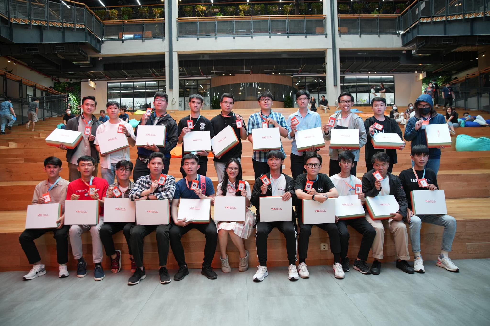

## Mở đầu

Hôm nay (4/5) là ngày đầu tiên mà mình chính thức được gia nhập VNG sau hai vòng tuyển chọn gần 2 tháng và tìm kiếm trong hơn 1000 bạn fresher đến từ các trường đại học hàng đầu ở TP.HCM về mảng CNTT. Mình thật sự cảm thấy may mắn khi được chọn trở thành 1 trong 21 Starter của nhà Zalopay.

## Buổi sáng 
Để chuẩn bị cho màn debut thật tươi và tràn đầy năng lượng, mình đã chuẩn bị chu đáo từ trang phục cho đến các vật dụng thường dùng như dù, áo mưa,... Sau đó, mình chạy từ nhà lên VNG Campus hơn 30km chặng đường khá xa và mệt mỏi nhưng cũng không đủ sức để ngăn chặn niềm hứng khởi trong mình. 

Sau khi đến được sảnh VNG, mình đã được chị HR đứng chờ bọn mình để phát dây đeo và từ đây mình chính thức là thành viên nhà Zalopay một cách vừa tự hào, vừa lo lắng, lo vì các bạn trúng tuyển vào quá giỏi và nỗ lực, nhìn họ mà lòng mình cũng tự hứa với bản thân mình hãy phấn đấu nhiều hơn, cạnh tranh nhiều hơn và học hỏi nhiều hơn để bằng bạn bằng bè mới được.

Sau đó mình có gặp Huế Như và Thiện Toàn, hai người bạn mà mình đã quen biết nhau từ khi mình còn đang thực tập ở Big-O Coding cũng trúng tuyển vào nhà Zalopay càng làm mình hào hứng hơn nữa vì mình biết mình vô đây không cô đơn :D. Tiếp đó mình cũng được làm quen với Tiến Thành, Trung Trực và Hữu Trưởng cũng giỏi, cũng quái vật không kém gì vì nhìn thành tích của họ đáng ngưỡng mộ. 

Mình được các anh chị HR hướng dẫn vào hội trường Oxford và Cambrigde cùng với các team khác như Zing Play, TrueID, Mapoly và Cloud, sau đó được chơi trò chơi khởi động rất vui từ các anh chị HRBP, mọi người tổ chức rất chuyên nghiệp và cung cấp nhiều kiến thức trò chơi về VNG. Trong qúa trình chơi, mặc dù team Zalopay chúng mình chơi rất hăng say, học hăng máu và đứng đầu bảng liên tục, cuối cùng bọn mình đã thua ngược dòng một cách đáng tiếc. Tuy nhiên, Zalopay team chúng mình đến không phải để chơi, bọn mình đến vì 2332Target!. 

## Buổi Trưa

Kết thúc một buổi sáng tràn đầy năng lượng, chị Xuân Thy (HR của bọn mình) với các anh chị HR khác dẫn bọn mình đi ăn chơi xả lán ở canteen VNG cùng với một bữa ăn đầy năng lượng và thịnh soạn như pizza, gà rán KFC, toàn đồ ăn cao cấp mà bọn sinh viên mình lâu lâu mới dám được ăn một lần (T.T)

## Buổi chiều
Sau giờ ăn căng thẳng, bọn mình được lùa về hội trường Oxford, ở đây chỉ có mỗi team Zalopay, bọn mình được phổ biến hierarchy cũng như là organziation của Zalopay team, và Zalopay team gồm những team nhỏ nào và những chức năng của team đó ra sao. Sau đó, các anh chị head của từng team sẽ chiêu mộ các bạn fresher vào theo đúng sở trường của họ (thật ra là đã được định đoạt sẵn khi các bạn fresher vào). Sau đó, bọn mình được các anh chị tặng quà và chụp hình theo mỗi ban, tiếp đó chị Thy dẫn mình đi làm hồ sơ thủ tục nhận việc và nhận máy, config vài thứ cho phù hợp với quá trình training. Tại thời điểm cuối cùng trước khi kết thúc ngày đầu tiên của mình, bọn mình được dẫn vào phòng ban của mình và gặp các anh buddy - người mà sẽ dẫn dắt bọn mình sau này về kỹ thuật lẫn tinh thần. Các anh rất vui vẻ và hòa đồng, một người đáng tin cậy. 

## Kết
Kết thúc một ngày dài tràn đầy năng lượng, với những con người thú vị và giỏi khủng khiếp, hi vọng những ngày sắp tới sẽ được cùng làm việc với những người như vậy để bản thân một ngày một tiến bộ hơn, vươn xa hơn.
